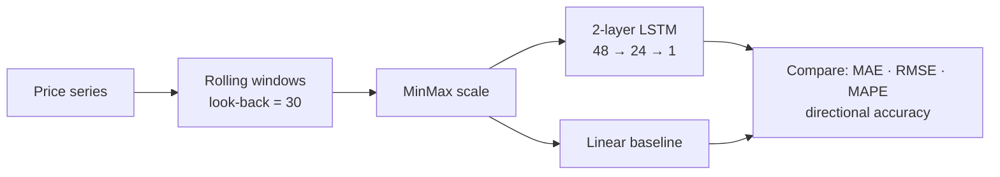

<div align="center">

# 🧠 LSTM Equity Forecaster

**A recurrent net for short-term price movement — held honest by a linear baseline.**


</div>

Most "the LSTM predicts the stock market" projects never check whether the LSTM actually
beats a trivial model — so they quietly report the network memorizing a random walk. This one
**benchmarks every run against a linear-regression baseline** and scores it on the metric that
matters for trading: **directional accuracy**, not just dollar error.

---

## How it works



1. Turn a price series into supervised `(window → next value)` pairs.
2. Scale, then train a stacked **LSTM (48 → 24 → dense)** in Keras.
3. Fit a **linear-regression baseline** on the same windows.
4. Score both with `metrics.py` — including **directional accuracy**, the fraction of steps
   where the predicted move has the right sign.

## Quickstart

```bash
pip install -r requirements.txt
python forecast.py                              # synthetic series, no network needed
python forecast.py --csv prices.csv --look 30 --epochs 20   # your own 'close' column
```

## Project structure

```
lstm-equity-forecaster/
├── forecast.py       # windowing, LSTM, linear baseline, evaluation
├── metrics.py        # MAE / RMSE / MAPE / directional accuracy
├── requirements.txt
└── README.md
```

## Why the baseline matters

A model that "predicts" price by echoing yesterday's value scores a great MAE and a
**coin-flip directional accuracy** — useless for trading. Reporting the LSTM *and* the linear
baseline side by side is the difference between a demo and an honest experiment.

## Extending it

- Feed real OHLCV via `yfinance` and add engineered features (returns, RSI, rolling vol).
- Predict *returns* instead of price levels to stop the model cheating on the trend.
- Walk-forward cross-validation instead of a single train/test split.

<div align="center"><sub>Built by <a href="https://github.com/adrian-erlikhman">Adrian Erlikhman</a> · MIT License · defaults to a synthetic series for reproducibility</sub></div>
