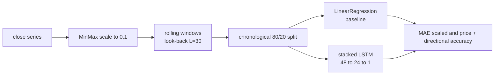

# LSTM Equity Forecaster

A stacked LSTM that forecasts the next-step price from a fixed look-back window, evaluated against a linear-regression baseline on the same windows and scored on **directional accuracy**, not just error. Runs offline on a synthetic trend + seasonality + noise series; accepts a real `close` series via `--csv`.

  



## Why a baseline

A model that predicts "tomorrow ≈ today" scores an excellent MAE on a trending price series and a coin-flip on *direction*. Reporting error alone is how forecasting demos overstate themselves. This repo fixes a linear baseline on the identical windows and reports directional accuracy alongside error, so the LSTM has to beat a trivial model on the metric that maps to a trading decision.

## Pipeline

- **Scaling.** `MinMaxScaler` to $[0,1]$; all error metrics are reported in scaled space and inverted back to price space.
- **Windowing.** Sequences $X_i=(s_{i},\dots,s_{i+L-1})$, target $y_i=s_{i+L}$, look-back $L=30$.
- **Split.** Chronological 80/20 (no shuffling — shuffling a time series leaks the future).
- **Baseline.** `LinearRegression` on the flattened window, i.e. an AR($L$) least-squares fit $\hat y=\sum_{j} \beta_j x_j + \beta_0$.

## Architecture

```
Input(L, 1)
LSTM(48, return_sequences=True)   # stacked recurrence over the window
LSTM(24)                          # compress to a fixed summary state
Dense(1)                          # next-step readout
```

Optimizer Adam, loss MSE, `batch_size=32`, `epochs=15` (CLI-overridable), `validation_split=0.1`, seeds fixed (`42`). Each LSTM layer maintains gates $(i_t,f_t,o_t)$ and cell state $c_t=f_t\odot c_{t-1}+i_t\odot\tilde c_t$, letting it carry information across the window rather than treating lags as independent features.

## Metrics

`metrics.py`. Error: MAE, RMSE, MAPE. Decision-relevant:

$$\text{DirAcc}=\frac{1}{n-1}\sum_{t}\mathbf{1}\!\left[\operatorname{sign}(y_{t+1}-y_t)=\operatorname{sign}(\hat y_{t+1}-\hat y_t)\right]$$

$0.50$ is a coin flip. The script prints scaled MAE, price-space MAE, and directional accuracy for both models on the held-out tail; because seeds are fixed the run is deterministic given a TensorFlow build.

## Reproduce

```bash
pip install -r requirements.txt
python forecast.py                              # synthetic series
python forecast.py --csv prices.csv --epochs 20 # real data: needs a 'close' column
python forecast.py --look 60                     # change the look-back window
```

## Limitations

- Next-step forecasting on a smooth synthetic series is an easy regime; real prices are near-random-walk at short horizons, and directional accuracy on live data will sit much closer to $0.50$.
- No transaction costs, position sizing, or walk-forward retraining — this is a forecasting harness, not a strategy.

MIT · synthetic series by default for reproducibility.
