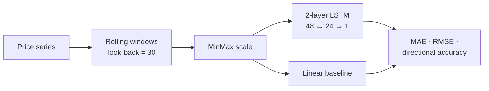

# 🧠 LSTM Equity Forecaster

  

A stacked LSTM for next-step price moves — kept honest by a linear baseline and scored on **directional accuracy**, not just error.



**How** — rolling windows → 2-layer LSTM, compared to linear regression on every run.
**Why it's honest** — a model that echoes yesterday's price scores a great MAE and coin-flip *direction*. Reporting directional accuracy alongside the baseline is the difference between a demo and an experiment.

## Run
```bash
pip install -r requirements.txt
python forecast.py                              # synthetic series
python forecast.py --csv prices.csv --epochs 20 # your data: 'close' column
```

<sub>MIT · Adrian Erlikhman · synthetic series by default for reproducibility</sub>
